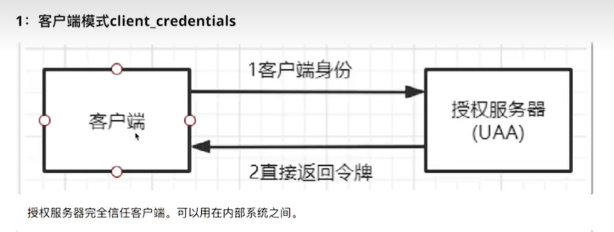

### 什么是OAuth 2.0  全称：Open Authorization

专门用于解决面向互联网的复杂权限验证功能

#### OAuth2.0包含以下几个角色：

##### 客户端：

浏览器、微信等本身不存储资源，需要通过资源拥有者的授权去请求资源服务器的资源

##### 资源拥有者：

示例中的用户，通常是用户，也可以是应用程序，资源拥有者

##### 认证服务器：

用于服务提供者对资源拥有者的身份进行验证，成功就会给客户端返回access_token

##### 资源服务器：

存储资源的服务器：

例如在使用微信登录百度的场景下：微信让百度可以获取到自己存储的用户信息，而百度让用户可以获取到很多受保护的资源

##### 重要概念：

Client_id :客户信息，代表着唯一的索引

Secret ：密钥 代表百度获取微信信息需要提供的一个加密字段

Scope：代表百度可以获取到的微信的信息范围

access_token ：授权码。百度获取微信用户信息的凭证。微信叫做接口调用凭证

grant_type 授权类型

### OAuth2.0 模式：

#### 四种授权模式

##### 客户端模式：

适用于内部系统直接通信

##### 密码模式：

通过提供用户名密码进行访问

用于系统内部开发的客户端申请访问系统

##### 简化模式：

##### 授权码模式：

SSO:

提到了OAuth就不得不说SSO，简单来说SSO就是身份的认证，而OAuth则是身份的认证授权。

SSO是通过session会话，通过身份校验器，将获取的session存到浏览器（redis）等存储中间件，一个系统下面的多个应用可以统一申请一个session进行访问（例如淘宝天猫就是采用SSO方式）

并且SSO只提供认证，登录之后即可访问当前资源所有的功能。而OAuth2.0则是通过SCOPE作用域的区分，明确不同权限对应访问的不同API

