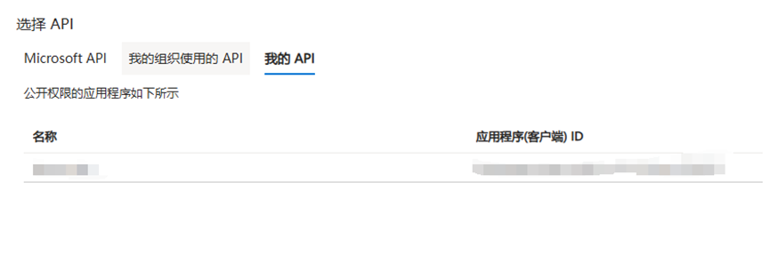

使用Azure AD技术实现对API的授权与保护（结合上期OAuth2.0介绍）


正好最近工作中遇到了使用Azure AD保护api的场景，并且先前学习了OAuth2.0 SSO等身份校验技术，所以特别做一期技术杂谈，探讨如何使用Azure AD 服务来实现API访问保护


### 一：创建AAD服务


首先找到Microsoft Entra ID，找到应用注册界面，新注册一个应用


注册之后，点击刚刚注册好的应用，进入API权限，点击添加权限


点击我的API，如果刚刚将注册的应用owner设置为你当前的账户 就可以看到刚刚注册好的应用

添加权限操作之后点击添加范围


添加作用域之后，会到公开API界面，点击添加客户端应用程序，将配置好的作用域添加进来。

再进入证书和密码界面，点击客户端密码，配置一个新的客户端密码（密码只显示一次，请保存）现在，Azure里面的AAD服务已经全部配置完毕

### 二：通过postman得到访问令牌


访问方式：post，请求URL地址：https://login.microsoftonline.com/{你自己的租户id} /oauth2/v2.0/token
Grant_type client_credentials
Client_id 当前Azure上的客户端id
Scope: api://{Client_id}/.default
Client_secret 刚刚创建的密码

### 三：为Flask API添加认证

Azure Global：

```python
app.config['AZURE_OAUTH_TENANCY'] = '当前租户id'
app.config['AZURE_OAUTH_APPLICATION_ID'] = '当前服务端id'

auth = FlaskAzureOauth()
auth.init_app(app)
@app.route('/unprotected')
def unprotected():
    return 'hello world'

@app.route('/protected')
@auth()
def protected():
    return 'hello authenticated entity'

@app.route('/protect_scope')
@auth('你的scope名称')
def protectScope():
    return 'hello authenticated scope entity'
```

通过FlaskAzureOauth()方法，自动验证AAD权限

注解中通过配置scope的名称 来决定当前api的访问权限

通过配置不同的scope和对应角色 实现不同API的访问权限设置