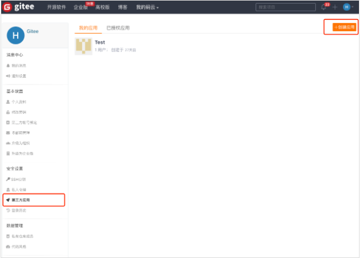
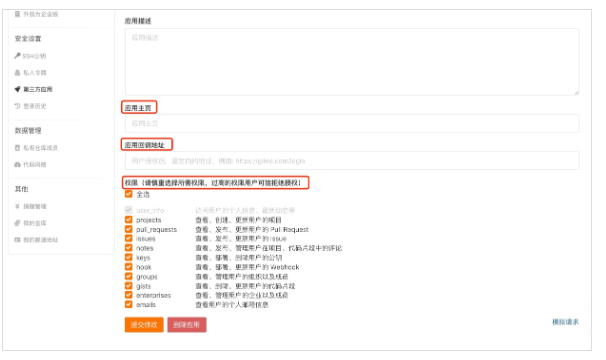

### OAuth2.0代码实现

上一期我们讲到了什么是OAuth2.0，那么本期将采用一个前端按钮 + fastapi后端结合的方式来开发一个基于OAuth2.0协议，对接gitee的第三方登录功能


#### 一：工具储备

了解FastAPI框架、了解OAuth2.0知识、创建gitee账号

#### 二：在gitee上开启一个第三方服务（作为第三方登录校验器）

1：在修改资料 -> 第三方应用 创建要接入码云的应用



2:填写相关信息，勾选所需要的权限



创建成功后，请记住你的Client ID Client Secret redirectUri


### 三：编写前端代码。跳转到gitee第三方登陆界面

```html
<!DOCTYPE html>
<html lang="zh-CN">
<head>
    <meta charset="UTF-8">
    <meta name="viewport" content="width=device-width, initial-scale=1.0">
    <title>码云第三方认证</title>
</head>
<body>
    <h1>码云第三方认证</h1>
    <button onclick="redirectToAuthPage()">授权码云</button>

    <script>
        function redirectToAuthPage() {
            const clientId = '19e3fc7ea81056e9abb2351ef76e0bf49f756346be1e1891bcc5d09e2edddb8e'; // 替换为你的client_id
            const redirectUri = encodeURIComponent('http://localhost:8000/callback'); // 替换为你的redirect_uri
            const authUrl = `https://gitee.com/oauth/authorize?client_id=${clientId}&redirect_uri=${redirectUri}&response_type=code`;
            window.location.href = authUrl;
        }
    </script>
</body>
</html>
```

点击之后即可跳转到


登录之后即可返回我们配置的重定向界面，并且带了一个授权码code

http://localhost:8000/callback?code=70b61856b6fb96775e7550e27a613236c3a0da7a280f63d29d7d04657114fc68

### 四：编写后端代码。拿到code并生成token

```python
token_url = "https://gitee.com/oauth/token"
token_params = {
    "grant_type": "authorization_code",
    "code": code,
    "client_id": GITEE_CLIENT_ID,
    "redirect_uri": GITEE_REDIRECT_URI,
    "client_secret": GITEE_CLIENT_SECRET
}
token_headers = {
    "Content-Type": "application/json"
}
token_response = requests.post(token_url, json=token_params, headers=token_headers)
if token_response.status_code != 200:
    raise HTTPException(status_code=400, detail="Failed to get access token")
token_data = token_response.json()
access_token = token_data.get("access_token")
if not access_token:
    raise HTTPException(status_code=400, detail="Access token not found")
```


### 五：杂谈

Gitee官方提供两种OAuth模式，授权码和账号密码模式。两种模式都可以实现第三方验证登录，