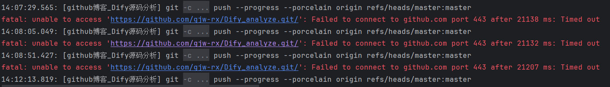
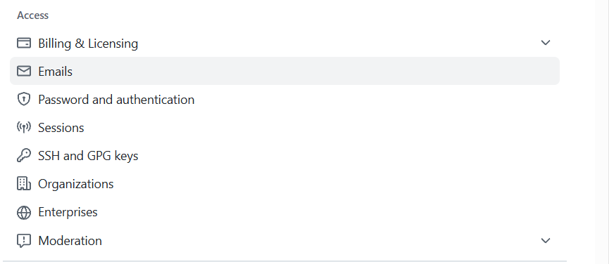

当我开心的写完了今天的编程开发心得，开心的推送，我真的无语了

就是说，超时真的心情很糟糕啊

搜索了一下我才发现，因为我用的都是https的请求协议，国内访问github就有几率会卡死

为此，我们将采用ssh的方法来解决我们的超时问题

SSH是通过公钥密钥的方式来验证身份的，密钥放在自己电脑上，公钥存到平台上

首先我们先检查我们电脑是否已经生成了sshkey

windows用户可以在C:\Users\\***\\.ssh查看

当然 你的电脑没有ssh的话也可以打开我们的cmd

输入ssh-keygen -t rsa -C "xxxxx@xxxxx.com"

具体按照提示操作即可

那么生成了这两个文件，请打开github（打不开的出门右拐）

点击自己头像后，找到setting  进入setting ，可以看到有一个ssh-gpg keys的选项

点击进入后可以看到一个很大的SSH keys 的选项 点击 New SSH key

设置一个你的title 和刚刚电脑上的id_rsa.pub 放到key中去

恭喜你已经设置完成了 现在可以通过ssh访问方式了